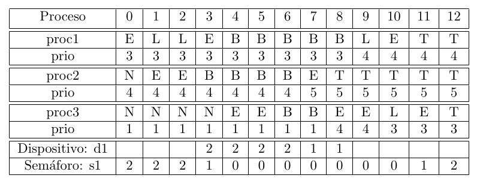

<div align="justify">

# Simulador monoprocesador

El siguiente documento ofrece una guía detallada de como ejecutar el simulador adjunto.

## Características

### Algoritmos soportados

El simulador soporta 4 tipos de planificaciones distintas:

* **FIFO**: La política de planificación será del tipo FIFO (First In - First Out), y los procesos serán atendidos por orden de llegada.

* **Round Robin (RR)**: El procesador atenderá a los procesos de forma cíclica, expulsando a
aquellos en los que ocurra un time-out por agotar la rodaja de tiempo asignada.

* **Primero el más corto (SJF)**: El procesador elige como proceso a ejecutar aquel cuya siguiente ráfaga de CPU sea la más corta.

* **Colas retroalimentadas (CR)**: En esta política cada proceso tendrá asignado un valor de prioridad. El procesador elegirá como proceso a ejecutar aquel que tenga la mayor
prioridad. Para procesos con la misma prioridad, son atendidos siguiendo una política Round-Robin, todas las colas con el mismo quantum. A lo largo de la ejecución del programa la prioridad podrá variar, incrementándose tras realizar una operación de E/S o un bloqueo en un semáforo, y decrementándose en una unidad al agotar su rodaja de tiempo.

### Salidas soportadas

El programa es capaz de generar la planificación de dos formas distinas:

* **Terminal**: La planificación se muestra por terminal en forma de tabla. Además, se muestra el estado de las colas de dispositivos/semáforos en cada instante de tiempo.

* **Archivo LaTeX** Se genera un archivo `.tex` listo para ser compilado y generar un archivo `.pdf` con la planificación.

## Pasos previos a la ejecución
Antes de comenzar con la ejecución del simulador tendremos que especificar los 
parámetros que este debe tener, así como los procesos que se van a ejecutar en él.

### Archivo de configuración
La información específica a cómo se debe comportar el simulador deberá estar
localizada en un único fichero, en el que se especifica el valor de cada uno de los parámetros.

El simulador soporta 12 parámetros:


* **Algoritmo**: específica el tipo de algoritmo a utilizar.
* **Máximo de unidades de tiempo**: indica el número total de u.t. que se van a simular.
* **Quantum:** Tamaño de la rodaja de tiempo (medido en u.t.) que se le asigna a un proceso.
* **Requisa por prioridad**: En las planificaciones con prioridad, si se desea que al llegar un proceso
al estado de listo con una prioridad mayor que el proceso en ejecución, este sea expulsado
para que se ejecute el proceso de mayor prioridad.
* **Nº dispositivos**: Especifica el número de dispositivos que habrá en el sistema, en los
cuales los procesos podrán bloquearse para realizar operaciones de E/S.
* **Nombre dispositivos**: Identificadores de los dispositivos anteriores. Se deberán incluir
tantos identificadores como dispositivos haya.
*  **Incremento dispositivos**: Para los algoritmos con planificación basada en colas de
prioridad, especifica el aumento del valor de prioridad que obtiene un proceso tras
realizar una operación de E/S en cada dispositivo.
* **Nº colas**: Indica el número total de colas de prioridad que hay. Unicamente para algoritmos basados en colas de prioridad. De haber n colas, la prioridad de los procesos podrá ir de 0 a n-1.

* **Nº semáforos**: Indica el número de semáforos en el sistema.

* **Nombre semáforos**: Identificadores de los semáforos anteriores. Se deberán incluir 
tantos identificadores como semáforos haya.

* **Valor semáforos**: Valor inicial de los semáforos del sistema.

* **Incremento semáforos**: Valor en el que se incrementa la prioridad de un proceso
al realizar un bloqueo en un semáforo en el sistema.

Los diferentes parámetros deberán ser puestos en un archivo de configuración atendiendo
a las siguientes restriccciones:

<div align="center">

| Parámetro               | Nombre parámetro          | Valores aceptados |
|:------------------------|:-------------------------:|------------------:|
| Algoritmo               | `algoritmo`               |  `FIFO/RR/SJF/CR` |
| Máximo instrucciones    | `max_ut`                  |       `int`       |
| Quantum                 | `quantum`                 |       `int`       |
| Requisa por prioridad   | `requisa`                 |       `S/N`       |
| Nº dispositivos         | `n_dispositivos`          |       `int`       |
| Nombre dispositivos     | `dispositivos`            |   `List[String]`  |
| Incremento dispositivos | `incremento_dispositivos` |    `List[int]`    |
| Nº colas                | `n_colas`                 |       `int`       |
| Nº semáforos            | `n_semaforos`             |       `int`       |
| Nombre semáforos        | `semaforos`               |   `List[String]`  |
| Valor semáforos         | `valor_semaforos`         |    `List[int]`    |
| Incremento semáforos    | `incremento_semaforos`    |       `int`       |


</div>

Por ejemplo, un archivo de configuración ejemplo que llamaremos `.conf` sería el siguiente:

<!-- la configuración de apacheconf es la que mejor muestra los colores -->
```apacheconf
algoritmo=CR
max_ut=13
quantum=2
requisa=S
n_dispositivos=1
dispositivos={d1}
incremento_dispositivos={1}
n_colas=10
n_semaforos=1
semaforos={s1}
valor_semaforos={2}
incremento_semaforos=3
```

> En el ejemplo de archivo de configuración anterior se especifica que se quiere aplicar un planificador con el algoritmo de colas realimentadas soportado por el simulador, con valores de prioridad dinámicas de 0 a 9, requisa por la llegada de un proceso de mayor prioridad y quantum de 2 u.t. Se incluye un dispositivo, d1, y se indica que el desbloqueo tras una espera en este dispositivos aumenta el nivel de prioridad en una unidad. Existe un semáforo s1, con valor inicial a 2. Salir de un bloqueo el semáforo aumenta la prioridad en 3 unidades. La simulación se detendrá tras el paso de 13 u.t.

Para un correcto parseo de los parámetros, se deberá seguir el formato indicado en la tabla anterior, sin dejar ningún espacio entre el nombre del parámetro y el valor asignado, ni entre las comas de las listas de valores.

---

Según el algoritmo elegido, ciertos parámetros serán obligatorios `✅`, estará prohibida su inclusión `❌` , serán opcionales `➖` o dependerá del valor de otro parámetro si es obligatorio incluirlo según la siguiente tabla:

<div align="center">

|        Algoritmo        |                     FIFO                     | Round Robin  | SJF  | Colas Realimentadas  | Valor por defecto  |
|:-----------------------:|:--------------------------------------------:|:------------:|:----:|:--------------------:|:------------------:|
|   Máximo u.t. |                      ➖                      |      ➖      |  ➖  |          ➖          |        `128`        |
|         Quantum         |                      ❌                      |      ✅      |  ➖  |          ➖          |         `-1`        |
|   Requisa por prioridad |                      ❌                      |      ❌      |  ➖  |          ➖          |         `N`         |
|     Nº Dispositivos     |                      ➖                      |      ➖      |  ➖  |          ➖          |         `0`         |
|   Nombre dispositivos   |          🔵 = `n_dispositivos>0`             |      🔵      |  🔵  |          🔵          |                  |
| incremento dispositivos |                      ❌                      |      ❌      |  ❌  |          🔵          |                 |
|         Nº Colas        |                      ❌                      |      ❌      |  ❌  |          ✅          |                 |
|       Nº semáforos      |                      ➖                      |      ➖      |  ➖  |          ➖          |         `0`         |
|     Valor semáforos     |            🟡 = `n_semaforos>0`              |      🟡      |  🟡  |          🟡          |                  |
|     Valor semáforos     |                      🟡                      |      🟡      |  🟡  |          🟡          |                  |
|   Incremento semáforos  |                      ❌                      |      ❌      |  ❌  |          🟡          |                  |

</div> 

> En el caso de específicar un parámetro marcado con ❌ para un algoritmo
> concreto, el comportamiento del simulador no queda definido. Aún pudiendo resultar
> en la planificación esperada. 
> 
> La misma situación es aplicable a cuando no se especifique
> un parámetro marcado como ✅

En la última fila se especifica el valor tomado por defecto en caso de que sea opcional la inclusión del parámetro y este no se haya especificado. Además, el algoritmo también será opcional, en ese caso se tomará como algoritmo por defecto FIFO, con las restricciones que arriba se especifican respecto a este algoritmo.

### Archivos de programa

Una vez específicados los parámetros del simulador, debemos específicar los procesos
que estarán en el sistema. De cada proceso pasaremos la siguiente información:

* **Lista de instrucciones a ejecutar**: Podrá ser de 4 tipos, operaciones de uso
del procesador, Signal / Wait sobre un semáforo, o realizar una operacion de E/S sobre un dispositivo.
* **Prioridad de inicio**: Prioridad con la que comienza el proceso.
* **Instante de tiempo en el que llega el proceso**: Momento de la planificación en el
que el proceso llega al sistema.

Dichos parámetros se especificarán de la siguiente forma:

<div align="center">

| Parámetro         |        Formato          | Valores aceptados |
|-------------------|:-----------------------:|------------------:|
| Operación CPU     |         `cpu(N) `       |        `N -> int` |
| Operación E/S     | `nombre_dispositivo(N)` |        `N -> int` |
| wait              |  `wait(nombre_semaforo)`   |                |
| signal            |  `signal(nombre_semaforo)`   |              |
| Prioridad         |           `#N`          |        `N -> int` |
| Tiempo de llegada |           `@N`          |        `N -> int` |

</div>

> Donde `nombre_dispositivo` debe ser un nombre específicado en el campo `dispositivos`
> del archivo de configuración y `nombre_semaforo` debe ser un nombre específicado en
> el campo `semaforos` del archivo de configuración.

> Las operaciones de `wait` y `signal` duran 1 u.t. cada una, y se requiere del procesador para ejecutarlas.

Por ejemplo, y siguiendo con el archivo de configuración anterior, creamos 3 procesos
llamados `proc1`, `proc2` y `proc3`:

#### proc1
```apacheconf
#3
@0
cpu(1)
wait(s1)
d1(2)
signal(s1)
```

#### proc2
```apacheconf
#4
@1
cpu(1)
wait(s1)
d1(4)
signal(s1)
```

#### proc3
```apacheconf
#1
@4
cpu(1)
wait(s1)
cpu(2)
signal(s1)
```

En el ejemplo del primer archivo se define un proceso que llega al sistema en el instante 0, con una prioridad inicial de 3 y ejecuta las siguientes acciones: una operación de CPU durante 1 u.t., un wait sobre el semáforo s1, una espera en el dispositivo d1 de 2 u.t. y finalmente un signal sobre s1.

## Ejecución
Una vez especificados los argumentos del simulador y los procesos que este tendrá,
procederemos a ejecutar el programa.

> Para el correcto funcionamiento del programa, los archivos de código fuente `.c`
> deberán estar bajo `src/` y los archivos de cabecera `.h` incluidos en `src/headers`

Para la ejecución del programa, este se invocará de la siguiente forma:

```console
user@pc:src$ ./main <conf_file> <proc1_file> <proc2_file> ... <procN_file>
```

Por lo que el programa de ejemplo anterior, teniendo todos los archivos de configuración
y de los procesos bajo `src/programs/` se haría de la siguiente forma:

```console
user@pc:src$ ./main programs/.conf programs/proc1 programs/proc2 programs/proc3
```

La ejecución del programa mostrará por pantalla la planificación y generará un archivo
`.tex` que podrá ser compilado utilizando LaTeX para obtener un pdf con la planificación.

El programa viene con un archivo `Makefile` bajo `src/` que ayuda a la compilación 
y ejecución del mismo. Al principio del archivo se define la variable `EXEC`, con una
instrucción por defecto con la que se invoca al programa.

En él podemos encontrar las siguientes reglas:

* **`build`**: Compila el codigo fuente generando los archivos objeto `.o` y el ejecutable
`main`.

* **`test`**: Compila y ejecuta el programa acorde a lo indicado en la variable `EXEC`.

* **`debug`**: Compila el programa y lo depura utilizando la herramienta `gdb`, invocando
el programa según lo indicado en `EXEC`.

* **`check`**: Compila el programa y lo ejecuta en búsqueda de leaks de memoria utilizando
la herramienta `valgrind`.

* **`plan`**: Compila el programa, lo ejecuta normalmente y genera un archivo `.pdf` con
la planificación a partir del archivo `.tex` generado.

* **`clean`**: Elimina los archivos `.o` y los relacionados con la planificación generada
para LaTeX.

> La regla por defecto en caso de no especificar ninguna será `build`
## Ejemplos

### Ejemplo: colas reatroalimentadas
Ejecutamos la configuración anterior:

```console
user@pc:src$ make build
gcc -Wall -Wextra -Werror -pedantic -std=c99 -g -c dispositivo.c -o dispositivo.o
gcc -Wall -Wextra -Werror -pedantic -std=c99 -g -c cola.c -o cola.o
gcc -Wall -Wextra -Werror -pedantic -std=c99 -g -c proceso.c -o proceso.o
gcc -Wall -Wextra -Werror -pedantic -std=c99 -g -c planificador.c -o planificador.o
gcc -Wall -Wextra -Werror -pedantic -std=c99 -g -c printer.c -o printer.o
gcc -Wall -Wextra -Werror -pedantic -std=c99 -g -c parser.c -o parser.o
gcc -Wall -Wextra -Werror -pedantic -std=c99 -g -c semaforo.c -o semaforo.o
gcc -Wall -Wextra -Werror -pedantic -std=c99 -g -c main.c -o main.o
gcc -Wall -Wextra -Werror -pedantic -std=c99 -g -o main dispositivo.o cola.o proceso.o planificador.o printer.o parser.o semaforo.o main.o 

user@pc:src$ ./main programs/.conf programs/proc1 programs/proc2 programs/proc3

Colas en instante t=4:
Dispositivo d1: 2 <- 1
Colas en instante t=5:
Dispositivo d1: 2 <- 1
Colas en instante t=6:
Dispositivo d1: 2 <- 1
Semáforo s1: 3
Colas en instante t=7:
Semáforo s1: 3
Todos los procesos han terminado
proc      0  1  2  3  4  5  6  7  8  9 10 11 12
proc1     E  L  L  E  B  B  B  B  B  L  E  T  T
prio      3  3  3  3  3  3  3  3  3  4  4  4  4

proc2     N  E  E  B  B  B  B  E  T  T  T  T  T
prio      4  4  4  4  4  4  4  5  5  5  5  5  5

proc3     N  N  N  N  E  E  B  B  E  E  L  E  T
prio      1  1  1  1  1  1  1  1  4  4  3  3  3


d1                 2  2  2  2  1  1            

s1        2  2  2  1  0  0  0  0  0  0  0  1  2
                               
```

Obtenemos una tabla con la planificación, en la que podemos ver en cada instante
el estado de cada proceso (E -> Ejecución, B -> Bloqueado, L -> Listo, T -> Terminado y N -> No se encuentra en el sistema),
la prioridad de cada uno (sólo para colas multinivel). Para cada dispositivo vemos el
proceso que estaba realizando operaciones de E/S en un instante dado y para cada semáforo el valor de su contador en cada momento.
Se muestra el número del proceso en el orden en el que se invocaron en el programa.

Podemos compilar el archivo `.tex` generado en `planificador/` para ver el resultado:

```console
user@pc:src$ pdflatex -output-directory .. ../planificacion.tex 
```

> será necesario tener instalado una distribución de LaTeX, por ejemplo Tex Live para sistemas GNU/Linux


Y lo visualizamos:

```console
user@pc:src$ xdg-open ../planificacion.pdf
```



### Ejemplo: planificación FIFO

A continuación vemos un ejemplo de una planificación utilizando el algoritmo FIFO, donde también se ve el uso de las anotaciones `@`

#### Configuración

```
algoritmo=FIFO
max_ut=25
n_dispositivos=2
dispositivos={d1,d2}
```

#### Proc1

```
@0
cpu(3)
d2(2)
cpu(5)
```

#### Proc2

```
@2
cpu(2)
d1(2)
cpu(5)
```

#### Proc3

```
@8
cpu(4)
d1(2)
cpu(1)
```


> Nótese como al no utilizar el algoritmo de colas retroalimentadas, tampoco es necesario el uso de las anotaciones `#`.

```console
user@pc:src$ ./main programs/.conf programs/proc1 programs/proc2 programs/proc3

Todos los procesos han terminado
proc	  0  1  2  3  4  5  6  7  8  9 10 11 12 13 14 15 16 17 18 19 20 21 22 23 24
proc1     E  E  E  B  B  E  E  E  E  E  T  T  T  T  T  T  T  T  T  T  T  T  T  T  T
proc2     N  N  L  E  E  B  B  L  L  L  E  E  E  E  E  T  T  T  T  T  T  T  T  T  T
proc3     N  N  N  N  N  N  N  N  L  L  L  L  L  L  L  E  E  E  E  B  B  E  T  T  T

d1                       2  2                                      3  3            
d2                 1  1      
```

### Ejemplo: SJF con requisa

Consideramos la siguiente configuración:

#### Configuración

```
algoritmo=SJF
max_ut=25
requisa=S
n_dispositivos=3
dispositivos={d1,d2,d3}

```

#### Proc1

```
cpu(1)
d1(3)
cpu(2)
d2(4)
cpu(3)
```

#### Proc2

```
cpu(2)
d2(4)
cpu(2)
d3(4)
cpu(3)
```

#### Proc3

```
cpu(5)
d1(2)
cpu(2)
d2(2)
cpu(2)
```

> Por defecto, si no se especifíca nada con la anotación `@` la entrada de los
> procesos se hará el primer instante

Lo ejecutamos y obtenemos la siguiente planificación:


```console
user@pc:src$ ./main programs/.conf programs/proc1 programs/proc2 programs/proc3

Colas en instante t=6:
Dispositivo d2: 2 <- 1
Todos los procesos han terminado
proc      0  1  2  3  4  5  6  7  8  9 10 11 12 13 14 15 16 17 18 19 20 21 22 23 24
proc1     E  B  B  B  E  E  B  B  B  B  B  L  E  E  E  T  T  T  T  T  T  T  T  T  T
proc2     L  E  E  B  B  B  B  E  E  B  B  B  B  L  L  L  L  E  E  E  T  T  T  T  T
proc3     L  L  L  E  L  L  E  L  L  E  E  E  B  B  L  E  E  B  B  L  E  E  T  T  T

d1           1  1  1                          3  3                                 
d2                 2  2  2  2  1  1  1  1                    3  3                  
d3                                   2  2  2  2                                    
```

### Ejemplo: Round Robin

Consideramos la siguiente configuración:

#### Configuración

```
algoritmo=RR
max_ut=14
quantum=2
```

#### Proc1

```
cpu(5)
```

#### Proc2

```
cpu(7)
```

#### Proc3

```
cpu(3)
```

Lo ejecutamos y obtenemos la siguiente planificación:

```console
user@pc:src$ ./main programs/.conf programs/proc1 programs/proc2 programs/proc3

Se ha alcanzado el máximo de unidades de tiempo a simular indicado, pero aún quedan 
procesos por ejecutar
proc      0  1  2  3  4  5  6  7  8  9 10 11 12 13
proc1     E  E  L  L  L  L  E  E  L  L  L  E  T  T
proc2     L  L  E  E  L  L  L  L  E  E  L  L  E  E
proc3     L  L  L  L  E  E  L  L  L  L  E  T  T  T
```

## Contribuir y contacto

Si encuentras cualquier bug en el programa, quieres contribuir a mejorarlo o deseas realizar cualquier otra consulta, no dudes en abrir un Issue en el proyecyo de GitHub.

También puedes contactar conmigo en `miguel.virtus@edu.uah.es`.

</div>